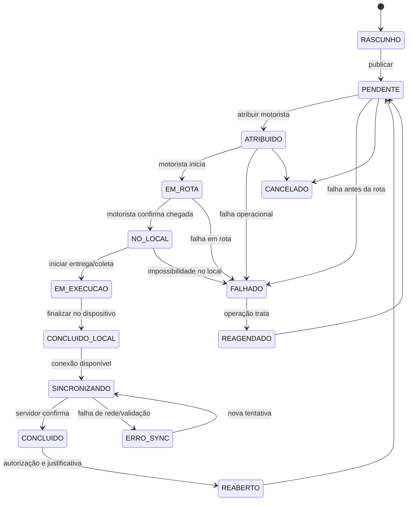
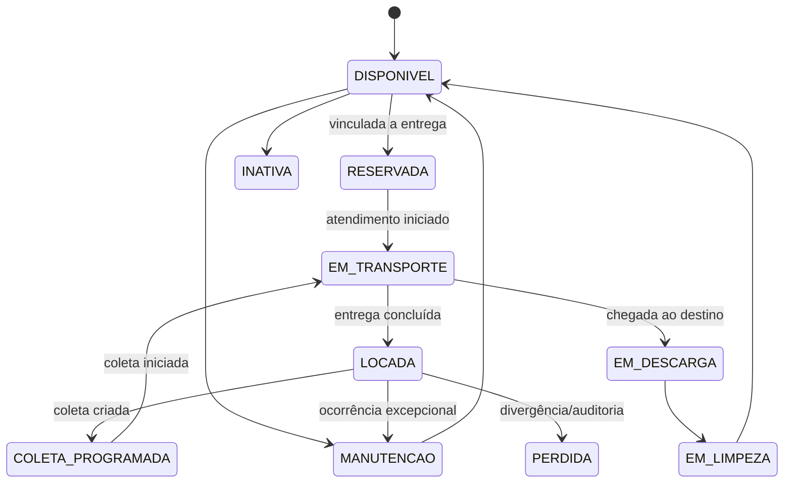
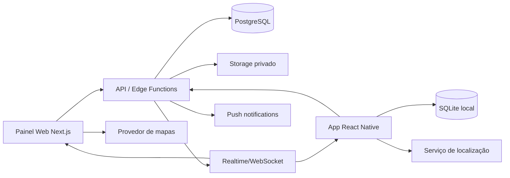

# Plano de Implementação — Sistema de Gestão Operacional de Caçambas

> **Nome provisório do produto:** CaçambaFlow  
> **Documento:** Plano técnico e funcional de implementação  
> **Versão:** 1.0  
> **Data:** 04/08/2026  
> **Status:** Pronto para refinamento e execução por equipe ou agente de desenvolvimento

---

## 1. Objetivo do documento

Este documento descreve um plano completo para implementar um sistema de gestão operacional de locação, entrega, troca e coleta de caçambas, composto por:

1. Painel web para gestores, controladores e equipe administrativa.
2. Aplicativo móvel para motoristas.
3. Centro de controle operacional com mapa e atualização em tempo real.
4. Operação offline no aplicativo móvel, com sincronização posterior.
5. Registro de evidências, como fotos, assinatura, observações e localização.
6. Controle de ativos, veículos, clientes, endereços, pedidos e atendimentos.
7. Recursos complementares de leitura de QR Code e OCR.

O objetivo é entregar um sistema funcionalmente equivalente ao fluxo demonstrado no material de referência, mas com arquitetura própria, código próprio, identidade própria e regras formalizadas neste documento.

---

## 2. Fontes e nível de certeza

### 2.1 Material principal

- Vídeo informado pelo solicitante: `https://youtu.be/NX97Dmwkmco`
- Título identificado: **Aplicativo Motoristas e Operação — Caçambas Online**.

### 2.2 Materiais complementares usados para validar telas e fluxos

Foram usados guias e páginas públicas do mesmo produto demonstrado no vídeo, incluindo:

- Guia resumido do aplicativo do motorista.
- Guia detalhado do atendimento pelo aplicativo.
- Guia de instalação e permissões.
- Documentação de operação offline e sincronização.
- Documentação de ordenação dos atendimentos.
- Documentação de QR Code.
- Documentação de OCR.
- Documentação do Centro de Controle Operacional.
- Documentação de evidências e falhas de atendimento.

### 2.3 Limitação da análise

O ambiente de análise não disponibilizou a transcrição completa do vídeo do YouTube. Por isso, o mapeamento foi validado com a documentação pública e com os guias visuais oficiais do mesmo sistema. Os itens marcados como **Confirmado** foram identificados diretamente nesses materiais. Os itens marcados como **Recomendado** são decisões de arquitetura, segurança ou usabilidade propostas para a nova implementação.

---

## 3. Visão do produto

### 3.1 Problema de negócio

Empresas de locação de caçambas normalmente precisam controlar, ao mesmo tempo:

- Pedidos de clientes.
- Endereços de entrega e coleta.
- Disponibilidade das caçambas.
- Veículos e motoristas.
- Entregas, coletas, trocas e tarefas.
- Prazos de permanência no cliente.
- Evidências de execução.
- Localização dos ativos e motoristas.
- Falhas de atendimento.
- Comunicação entre a base e a equipe de campo.

Quando esse controle ocorre por papel, planilha e WhatsApp, surgem problemas de duplicidade, perda de informação, atraso, falta de prova de execução e baixa visibilidade operacional.

### 3.2 Proposta de valor

Centralizar toda a operação em uma plataforma única, permitindo que:

- O operador planeje e distribua atendimentos.
- O motorista receba o itinerário do dia no celular.
- O motorista execute o serviço mesmo sem internet.
- Fotos, assinatura, GPS e observações sejam registradas como evidência.
- O gestor acompanhe a operação e a posição dos motoristas em tempo real.
- A empresa saiba onde cada caçamba está e qual o seu status.
- Falhas sejam registradas e tratadas rapidamente.

### 3.3 Princípios do produto

1. **Mobile first para o motorista.**
2. **Offline first em campo.**
3. **Operação simples, com poucos cliques.**
4. **Toda ação importante gera histórico auditável.**
5. **Evidências não podem ser perdidas.**
6. **Operações críticas devem ser idempotentes.**
7. **Segurança multiempresa desde a primeira versão.**
8. **Rastreamento somente durante a jornada operacional autorizada.**

---

## 4. Perfis de usuário e permissões

## 4.1 Superadministrador da plataforma

Responsável pelo SaaS e não pela operação de uma empresa específica.

Permissões:

- Criar, editar, bloquear e excluir empresas.
- Definir plano, limites e recursos contratados.
- Visualizar métricas técnicas e de utilização.
- Gerenciar suporte e impersonação controlada.
- Configurar recursos globais.
- Acessar logs técnicos, sem acesso irrestrito a evidências privadas.

## 4.2 Administrador da empresa

Responsável pela configuração da conta da empresa.

Permissões:

- Gerenciar usuários e perfis.
- Gerenciar motoristas, veículos e caçambas.
- Gerenciar motivos de falha.
- Definir tipos de atendimento.
- Configurar obrigatoriedade de fotos e assinatura.
- Configurar rastreamento.
- Visualizar toda a operação da empresa.
- Exportar relatórios.

## 4.3 Gestor operacional

Responsável pela visão geral e tomada de decisão.

Permissões:

- Visualizar central operacional.
- Acompanhar mapa.
- Criar e editar pedidos.
- Criar, distribuir e reatribuir atendimentos.
- Alterar prioridade e sequência.
- Visualizar evidências.
- Reabrir atendimento conforme regra e justificativa.
- Tratar falhas e reagendamentos.

## 4.4 Operador/controlador

Responsável pelo despacho diário.

Permissões:

- Cadastrar clientes e endereços.
- Criar pedidos e atendimentos.
- Atribuir motorista, veículo e caçamba.
- Ordenar itinerários.
- Acompanhar status.
- Consultar evidências.
- Registrar observações operacionais.

## 4.5 Financeiro

Perfil opcional, fora do núcleo operacional inicial.

Permissões futuras:

- Visualizar valores dos pedidos.
- Emitir faturas, recibos e cobranças.
- Dar baixa em pagamentos.
- Gerenciar contas a pagar e receber.

## 4.6 Motorista

Utiliza o aplicativo móvel.

Permissões:

- Fazer login.
- Selecionar veículo autorizado.
- Iniciar e encerrar jornada online.
- Visualizar atendimentos atribuídos.
- Ordenar por regra permitida.
- Abrir rota no aplicativo de mapas.
- Iniciar atendimento.
- Confirmar chegada.
- Entregar, coletar, trocar ou concluir tarefa.
- Ler QR Code ou número por OCR.
- Informar identificador da caçamba.
- Capturar fotos.
- Coletar assinatura.
- Registrar observações.
- Registrar falha.
- Trabalhar offline e sincronizar depois.

## 4.7 Auditor/leitura

Permissões:

- Consultar pedidos, atendimentos, evidências e históricos.
- Não editar dados operacionais.
- Exportar relatórios conforme autorização.

---

## 5. Escopo funcional

## 5.1 Escopo do MVP

O MVP deve incluir:

- Multiempresa.
- Login e controle de acesso.
- Cadastro de usuários.
- Cadastro de motoristas.
- Cadastro de veículos.
- Cadastro de caçambas.
- Cadastro de clientes e endereços.
- Criação de pedidos.
- Criação de atendimentos de entrega, coleta, troca e tarefa.
- Atribuição de motorista e veículo.
- Lista diária de atendimentos no app.
- Estados: pendente, em rota, cheguei, em execução, concluído e falhado.
- Fotos e assinatura.
- Observações.
- Registro de localização.
- Operação offline.
- Sincronização resiliente.
- Painel web operacional.
- Mapa com última posição conhecida dos motoristas.
- Histórico e auditoria.

## 5.2 Escopo da versão 1.1

- Rastreamento contínuo em segundo plano.
- Atualização em tempo real no painel.
- Reordenação manual de itinerário pela empresa.
- Ordenação por prioridade e distância.
- Notificações push.
- QR Code nas caçambas.
- Geração de comprovante em PDF.
- Compartilhamento de comprovante.

## 5.3 Escopo da versão 1.2

- OCR para localizar caçamba pelo número pintado.
- Otimização de rotas.
- Geofencing opcional.
- Portal do cliente.
- Solicitação de retirada ou troca por link.
- Integração com WhatsApp.
- Alertas de vencimento da locação.
- Controle de destinação e documentos ambientais.

## 5.4 Fora do escopo inicial

- Contabilidade completa.
- Folha de pagamento.
- Telemetria nativa do veículo.
- Roteirização avançada com restrições de tráfego pesado.
- Marketplace público de locação.
- Integração com balanças industriais.
- Emissão fiscal completa.

---

## 6. Entidades principais do domínio

1. Empresa.
2. Unidade/filial.
3. Usuário.
4. Perfil e permissão.
5. Motorista.
6. Veículo.
7. Caçamba/ativo.
8. Tipo de caçamba.
9. Cliente.
10. Endereço/obra.
11. Pedido.
12. Item do pedido.
13. Atendimento/ordem de serviço.
14. Tipo de atendimento.
15. Atribuição de atendimento.
16. Evento de status.
17. Itinerário.
18. Posição GPS.
19. Evidência.
20. Assinatura.
21. Motivo de falha.
22. Falha de atendimento.
23. Fila de sincronização.
24. Notificação.
25. Documento/comprovante.
26. Registro de auditoria.

---

## 7. Tipos de atendimento

## 7.1 Entrega

Movimentação de uma caçamba disponível para um endereço de cliente.

Resultado esperado:

- Caçamba muda de `disponível` para `locada`.
- Localização operacional passa a ser o endereço do cliente.
- Data de entrega é registrada.
- Prazo previsto de permanência pode ser iniciado.
- Evidências são anexadas.

## 7.2 Coleta

Retirada da caçamba do endereço do cliente.

Resultado esperado:

- Caçamba pode mudar para `em_transporte`, `em_descarga`, `em_pátio`, `em_limpeza` ou `disponível`, conforme fluxo configurado.
- Data e hora de coleta são registradas.
- Número da caçamba deve ser validado.
- Evidências podem comprovar conteúdo, condição e retirada.

## 7.3 Troca

Combinação operacional de uma coleta com uma entrega no mesmo local ou pedido relacionado.

Resultado esperado:

- Uma caçamba é retirada.
- Outra caçamba é entregue.
- Os dois atendimentos ficam relacionados por um `swap_group_id`.
- O operador pode atribuir ambos ao mesmo motorista.
- A conclusão de cada etapa mantém rastreabilidade independente.

## 7.4 Tarefa

Atividade que não movimenta necessariamente uma caçamba.

Exemplos:

- Vistoria.
- Retorno ao cliente.
- Entrega de documento.
- Manutenção simples.
- Conferência de local.

---

## 8. Fluxo operacional de ponta a ponta

## 8.1 Cadastro e preparação

1. Administrador cadastra a empresa.
2. Administrador cadastra usuários.
3. Administrador cadastra motoristas.
4. Administrador cadastra veículos.
5. Administrador cadastra caçambas e capacidades.
6. Administrador cadastra motivos de falha.
7. Operador cadastra cliente e obra/endereço.

## 8.2 Criação do pedido

1. Operador seleciona ou cria um cliente.
2. Seleciona o endereço da obra.
3. Define o tipo de serviço.
4. Define o tipo/tamanho da caçamba.
5. Define data prevista.
6. Informa observações e restrições de acesso.
7. Salva o pedido.
8. Sistema gera um ou mais atendimentos.

## 8.3 Despacho

1. Operador abre atendimentos pendentes.
2. Filtra por data, região, tipo ou prioridade.
3. Seleciona atendimento.
4. Atribui motorista e veículo.
5. Opcionalmente atribui caçamba.
6. Define posição no itinerário.
7. Publica o atendimento.
8. O atendimento fica disponível no app.
9. Motorista recebe atualização por tempo real ou push.

## 8.4 Início da jornada do motorista

1. Motorista faz login.
2. Seleciona veículo autorizado.
3. Concede permissões de câmera, localização e notificações.
4. Ativa o status `Online`.
5. Aplicativo inicia rastreamento autorizado.
6. Aplicativo baixa a agenda do dia e os dados necessários para operação offline.

## 8.5 Execução de um atendimento

1. Motorista abre a aba `Pendentes`.
2. Seleciona um atendimento.
3. Visualiza cliente, endereço, tipo, capacidade, observações e status.
4. Pode abrir a rota no Waze/Google Maps.
5. Arrasta/confirma `Iniciar atendimento`.
6. Atendimento muda para `Em rota`.
7. Ao chegar, confirma `Cheguei`.
8. Atendimento muda para `No local`.
9. Executa entrega ou coleta.
10. Abre tela de conclusão.
11. Informa ou confirma a caçamba.
12. Adiciona fotos obrigatórias.
13. Coleta assinatura quando exigida.
14. Informa observações.
15. Confirma `Finalizar atendimento`.
16. Aplicativo grava localmente.
17. Quando houver internet, sincroniza com o servidor.
18. Painel web recebe a atualização.

## 8.6 Falha de atendimento

1. Motorista toca em `Falha`.
2. Seleciona motivo configurado pela empresa.
3. Escreve observação complementar, se exigida.
4. Anexa foto, se exigido.
5. Confirma a falha.
6. Atendimento muda para `Falhado`.
7. Operação recebe alerta.
8. Gestor pode reagendar, cancelar ou reatribuir.

## 8.7 Encerramento da jornada

1. Motorista verifica se todas as ações locais estão sincronizadas.
2. Aplicativo exibe situação da fila de sincronização.
3. Enquanto houver itens pendentes, o encerramento apresenta alerta.
4. Motorista coloca o status como `Offline`.
5. Rastreamento é interrompido.
6. Horário de encerramento é registrado.

---

## 9. Máquina de estados do atendimento



### 9.1 Regras de transição

- Um atendimento só pode ser iniciado por motorista atualmente atribuído.
- Um motorista só pode iniciar atendimento se estiver online, salvo configuração de contingência.
- `Cheguei` exige localização capturada, quando a permissão estiver disponível.
- `Concluído` exige todos os campos obrigatórios definidos para aquele tipo de atendimento.
- O dispositivo pode marcar `CONCLUIDO_LOCAL` mesmo offline.
- O servidor é a autoridade final para o estado `CONCLUIDO`.
- Reabertura exige perfil autorizado, justificativa e log de auditoria.
- Uma operação não pode retroceder estado silenciosamente.

---

## 10. Máquina de estados da caçamba



### 10.1 Regras de disponibilidade

- A mesma caçamba não pode ser vinculada a dois atendimentos simultâneos incompatíveis.
- Reserva deve possuir prazo de expiração.
- Entrega concluída atualiza o ativo para o endereço do cliente.
- Coleta concluída atualiza a localização e o estado conforme o próximo destino.
- Troca movimenta dois ativos de forma relacionada, mas transacionalmente independente.

---

## 11. Módulos do painel web

## 11.1 Autenticação

Telas:

- Login.
- Recuperação de senha.
- Primeiro acesso.
- Alteração de senha.
- Sessões ativas.
- Autenticação em dois fatores para administradores, recomendada.

## 11.2 Dashboard operacional

Indicadores:

- Atendimentos do dia.
- Entregas pendentes.
- Coletas pendentes.
- Trocas pendentes.
- Tarefas pendentes.
- Em rota.
- No local.
- Concluídos.
- Falhados.
- Sem motorista.
- Motoristas online.
- Caçambas disponíveis.
- Caçambas locadas.
- Caçambas vencidas.
- Sincronizações pendentes ou com erro.

## 11.3 Cadastro de clientes

Campos:

- Tipo: pessoa física ou jurídica.
- Nome/razão social.
- CPF/CNPJ.
- Telefone.
- WhatsApp.
- E-mail.
- Observações.
- Status.

## 11.4 Cadastro de endereços/obras

Campos:

- Cliente.
- Nome da obra.
- CEP.
- Logradouro.
- Número.
- Complemento.
- Bairro.
- Cidade.
- Estado.
- Latitude.
- Longitude.
- Tipo de estacionamento.
- Ponto de referência.
- Restrições de acesso.
- Janela de atendimento.
- Contato no local.

## 11.5 Cadastro de veículos

Campos:

- Placa.
- Marca.
- Modelo.
- Cor.
- Ano.
- Tipo.
- Capacidade.
- Dimensões.
- Peso.
- Status.
- Motoristas autorizados.
- Unidade/filial.

## 11.6 Cadastro de motoristas

Campos:

- Nome.
- CPF.
- Telefone.
- E-mail de acesso.
- Matrícula.
- CNH.
- Categoria.
- Validade da CNH.
- Foto.
- Veículos autorizados.
- Status.
- Permissão de rastreamento vinculada ao contrato e política da empresa.

## 11.7 Cadastro de caçambas

Campos:

- Identificador único.
- Código interno.
- QR Code.
- Capacidade em m³.
- Tipo/modelo.
- Cor.
- Situação.
- Unidade/filial.
- Data de aquisição.
- Última manutenção.
- Latitude e longitude operacionais.
- Endereço atual.
- Último atendimento.
- Observações.

## 11.8 Pedidos

Recursos:

- Criar pedido.
- Duplicar pedido.
- Criar pedido recorrente.
- Adicionar entrega, coleta ou troca.
- Relacionar pedidos.
- Visualizar histórico.
- Visualizar atendimentos relacionados.
- Visualizar evidências.
- Cancelar com justificativa.

## 11.9 Atendimentos

Visões:

- Pendentes.
- Atribuídos.
- Em rota.
- No local.
- Em execução.
- Concluídos.
- Falhados.
- Cancelados.

Filtros:

- Data.
- Tipo.
- Motorista.
- Veículo.
- Cliente.
- Bairro/cidade.
- Status.
- Prioridade.
- Com ou sem caçamba.
- Com ou sem evidência.
- Com erro de sincronização.

Ações em lote:

- Atribuir motorista.
- Atribuir veículo.
- Alterar data.
- Alterar prioridade.
- Reordenar itinerário.
- Cancelar.
- Gerar rota.

## 11.10 Centro de Controle Operacional

Layout recomendado:

- Mapa ocupando aproximadamente 65% da tela.
- Painel lateral com atendimentos e motoristas.
- Filtros superiores.
- Marcadores distintos para motoristas, caçambas locadas, pontos de entrega e pontos de coleta.
- Cores por estado.
- Atualização sem recarregar a página.

Dados exibidos ao clicar no motorista:

- Nome.
- Veículo.
- Status online/offline.
- Última atualização.
- Velocidade aproximada, se coletada e necessária.
- Atendimento atual.
- Próximo atendimento.
- Bateria do aparelho, opcional.
- Precisão da localização.

Dados exibidos ao clicar na caçamba:

- Identificador.
- Capacidade.
- Status.
- Cliente atual.
- Endereço.
- Data de entrega.
- Previsão de coleta.
- Última evidência.

## 11.11 Evidências

Tipos:

- Foto da entrega.
- Foto da coleta.
- Foto do local.
- Foto do resíduo.
- Foto de avaria.
- Assinatura.
- Documento.
- Localização.
- Observação.

Recursos:

- Galeria.
- Visualização por atendimento.
- Download controlado.
- Metadados de data, hora e GPS.
- Identificação do usuário/dispositivo.
- Hash do arquivo para integridade.
- Retenção conforme plano e política.

## 11.12 Motivos de falha

Campos:

- Nome.
- Descrição.
- Ativo/inativo.
- Exige observação.
- Exige foto.
- Permite reagendamento automático.
- Categoria: cliente, veículo, acesso, clima, ativo, operação ou outro.

---

## 12. Telas do aplicativo do motorista

## 12.1 Splash e verificação inicial

Funções:

- Verificar versão mínima.
- Inicializar banco local.
- Restaurar sessão.
- Verificar migrações locais.
- Verificar permissões essenciais.
- Verificar fila de sincronização.

## 12.2 Login

Campos:

- E-mail.
- Senha.
- Recuperar senha.

Regras:

- Não permitir autocadastro de motorista, salvo decisão futura.
- Credencial é criada pela empresa.
- Armazenar token de forma segura.
- Permitir biometria como atalho após primeiro login.

## 12.3 Permissões

Solicitar de forma progressiva:

1. Notificações.
2. Câmera.
3. Localização durante o uso.
4. Localização em segundo plano, somente quando o motorista ativar a jornada online e após tela educativa.

Nunca solicitar todas as permissões sem explicar o motivo.

## 12.4 Seleção de veículo

Exibir:

- Modelo.
- Placa.
- Cor.
- Capacidade/dimensões.
- Status.

Regras:

- Exibir apenas veículos autorizados ao motorista.
- Impedir seleção de veículo em manutenção ou já ocupado, conforme configuração.
- Registrar início e fim do vínculo de jornada.

## 12.5 Tela principal — Pendentes

Componentes:

- Cabeçalho com menu, título e ordenação.
- Indicador online/offline.
- Chips de quantidade: entregas, coletas e tarefas.
- Lista de cartões.
- Barra inferior: Pendentes, Concluídos e Falhas.

Cada cartão deve mostrar:

- Tipo de atendimento.
- Cliente.
- Endereço.
- Capacidade.
- Identificador da caçamba, quando já definido.
- Observações.
- Tag de troca.
- Data.
- Prioridade.
- Código do atendimento.
- Estado de sincronização.

## 12.6 Detalhes do atendimento

Exibir:

- Tipo.
- Cliente.
- Telefone.
- Resíduo.
- Número de controle.
- Número do atendimento.
- Forma de pagamento, caso o perfil possa visualizar.
- Valor, caso autorizado.
- Endereço completo.
- Distância estimada.
- Observações.
- Botão para rota.
- Botão de iniciar atendimento.

## 12.7 Atendimento em rota

Exibir:

- Mapa resumido.
- Destino.
- Botão `Ir`.
- Botão `Falha`.
- Controle deslizante `Cheguei`.
- Botão para pausar e voltar à lista sem concluir, com confirmação clara.

## 12.8 Atendimento no local

Ações:

- Entregar.
- Coletar.
- Confirmar troca.
- Falhar.
- Voltar à lista com estado `Em andamento`.

## 12.9 Tela de conclusão

Campos e evidências:

- Identificador da caçamba.
- Número de controle.
- Foto obrigatória.
- Assinatura.
- Observações finais.
- GPS da conclusão.
- Data/hora do dispositivo.
- Data/hora do servidor após sincronização.
- Botão deslizante de finalização.

## 12.10 Falha

Campos:

- Motivo.
- Observação.
- Foto, quando exigida.
- Localização.
- Confirmação.

## 12.11 Concluídos

Exibir:

- Atendimentos concluídos localmente.
- Atendimentos sincronizando.
- Atendimentos sincronizados.
- Atendimentos com erro.

Sugestão de estados visuais:

- Verde: sincronizado.
- Azul: aguardando processamento.
- Amarelo: aguardando rede ou tentativa.
- Vermelho: erro que exige ação.

Não depender apenas de cor; exibir texto e ícone.

## 12.12 Menu lateral

Itens:

- Perfil.
- Veículo atual.
- Trocar veículo.
- Status online/offline.
- Sincronização.
- Diagnóstico de permissões.
- Ajuda.
- Sair.

---

## 13. Ordenação do itinerário

Modos confirmados no produto de referência:

1. Definido pela empresa.
2. Prioridade.
3. Distância.

### 13.1 Definido pela empresa

- Operador define a sequência.
- Aplicativo respeita `sequence_number`.
- Motorista não altera a ordem, salvo permissão.

### 13.2 Prioridade

- Ordenar por prioridade decrescente.
- Em empate, usar janela de atendimento e distância.

### 13.3 Distância

- Ordenar pela distância entre a localização atual e o atendimento.
- Recalcular apenas quando solicitado ou em intervalo controlado.
- Não alterar automaticamente um atendimento já iniciado.

### 13.4 Recomendação futura

Adicionar modo `Rota otimizada`, calculado no servidor por API de matriz de distâncias, considerando:

- Capacidade do veículo.
- Tipo de operação.
- Janela de atendimento.
- Prioridade.
- Endereço.
- Restrições de circulação.

---

## 14. QR Code

## 14.1 Objetivo

Reduzir erro de digitação e garantir que a caçamba movimentada corresponde ao atendimento.

## 14.2 Fluxo em coleta

1. Motorista abre leitor de QR Code.
2. Escaneia etiqueta da caçamba.
3. Aplicativo obtém `asset_public_code`.
4. Procura atendimento pendente correspondente.
5. Se encontrado, oferece iniciar ou abrir conclusão.
6. Se não encontrado, informa `Ativo não encontrado na sua lista`.

## 14.3 Fluxo na conclusão da coleta

- O QR lido deve corresponder à caçamba esperada.
- Divergência exige confirmação da base ou justificativa autorizada.

## 14.4 Fluxo na entrega

- QR lido preenche automaticamente a caçamba entregue.
- Servidor valida disponibilidade e compatibilidade de capacidade.

## 14.5 Conteúdo do QR

Não colocar dados sensíveis diretamente.

Formato recomendado:

```text
CF1:<public_asset_uuid>:<checksum>
```

O servidor resolve o UUID público para o ativo interno.

---

## 15. OCR

## 15.1 Objetivo

Identificar o número pintado na caçamba e localizar rapidamente o atendimento de coleta correspondente.

## 15.2 Fluxo

1. Motorista abre OCR na lista de coletas.
2. Câmera exibe quadrante de enquadramento.
3. OCR reconhece um número.
4. Aplicativo mostra o texto detectado.
5. Motorista confirma `Usar texto escaneado`.
6. Aplicativo procura atendimento pendente compatível.
7. Se encontrado, abre o atendimento.
8. Se não encontrado, permite busca manual e contato com a base.

## 15.3 Regras

- Restringir reconhecimento a números e padrão configurado.
- Mostrar confiança da leitura quando disponível.
- Nunca concluir automaticamente apenas pelo OCR.
- Motorista deve confirmar o número.
- Manter busca manual como alternativa.

## 15.4 Tecnologia sugerida

- Processamento local no aparelho quando possível.
- Serviço remoto apenas como fallback, devido a privacidade e operação offline.
- Registrar somente resultado e confiança; não armazenar imagem bruta sem necessidade operacional.

---

## 16. Arquitetura recomendada

## 16.1 Visão geral



## 16.2 Stack sugerida

### Painel web

- Next.js com TypeScript.
- React.
- Componentes acessíveis.
- TanStack Query para estado de servidor.
- Biblioteca de formulários com validação por schema.
- Mapa com Google Maps, Mapbox ou alternativa compatível.

### Aplicativo móvel

- React Native com Expo Development Build/EAS.
- TypeScript.
- SQLite para persistência local.
- Task Manager/serviço de localização em segundo plano.
- NetInfo para estado de rede.
- Câmera para fotos, QR e OCR.
- Secure Store para tokens.

### Backend

Opção recomendada para velocidade de implementação:

- Supabase.
- PostgreSQL.
- Supabase Auth.
- Row Level Security.
- Supabase Storage privado.
- Realtime.
- Edge Functions para regras críticas e integrações.

Alternativa para maior controle:

- NestJS.
- PostgreSQL.
- Redis.
- S3 compatível.
- WebSocket.
- BullMQ para filas.

### Recomendação de decisão

Para o primeiro produto comercial, usar **Next.js + React Native + Supabase/PostgreSQL**. Migrar partes para backend dedicado apenas quando volume, custo ou complexidade justificarem.

## 16.3 Monorepo

Estrutura sugerida:

```text
/apps
  /web
  /mobile
  /admin
/packages
  /ui
  /domain
  /validation
  /api-client
  /types
  /sync-engine
  /config
/supabase
  /migrations
  /functions
  /seed
/docs
  /architecture
  /adr
  /flows
```

---

## 17. Arquitetura offline first

## 17.1 Princípio

O aplicativo não deve depender de conexão contínua para executar os atendimentos já baixados.

## 17.2 Banco local

Tabelas locais mínimas:

- `local_users`.
- `local_vehicle_session`.
- `local_assignments`.
- `local_jobs`.
- `local_customers`.
- `local_addresses`.
- `local_assets`.
- `local_evidences`.
- `local_status_events`.
- `sync_outbox`.
- `sync_inbox_checkpoint`.
- `local_settings`.

## 17.3 Outbox transacional

Toda alteração local deve:

1. Atualizar a tabela local.
2. Criar um evento na `sync_outbox` na mesma transação SQLite.
3. Exibir a alteração imediatamente ao usuário.
4. Sincronizar quando a conexão estiver disponível.

Exemplo de evento:

```json
{
  "event_id": "uuid",
  "tenant_id": "uuid",
  "device_id": "uuid",
  "aggregate_type": "job",
  "aggregate_id": "uuid",
  "event_type": "JOB_COMPLETED",
  "occurred_at_device": "2026-08-04T14:30:00-03:00",
  "payload": {
    "asset_id": "uuid",
    "latitude": -23.0,
    "longitude": -46.0,
    "notes": "Entrega realizada"
  },
  "retry_count": 0
}
```

## 17.4 Idempotência

- Todo evento possui `event_id` único.
- Servidor mantém tabela de eventos processados.
- Reenvio do mesmo evento retorna sucesso sem duplicar efeitos.
- Upload de evidência usa chave determinística.

## 17.5 Ordem de sincronização

1. Eventos de início/chegada/conclusão.
2. Metadados de evidência.
3. Upload dos arquivos.
4. Confirmação final do atendimento.

Uma conclusão só se torna definitiva no servidor quando as evidências obrigatórias forem validadas ou quando a política permitir upload posterior.

## 17.6 Política de retry

- Tentativa imediata.
- 5 segundos.
- 15 segundos.
- 30 segundos.
- 1 minuto.
- 5 minutos.
- 15 minutos.
- Depois, tentativa periódica e manual.

Usar backoff exponencial com jitter.

## 17.7 Conflitos

Cenários:

- Atendimento reatribuído enquanto motorista estava offline.
- Atendimento cancelado enquanto já estava em execução.
- Caçamba atribuída a outro atendimento.
- Dados do cliente alterados.

Estratégia:

- Eventos de campo nunca são descartados.
- Servidor registra conflito e mantém evidência.
- Mudanças cadastrais usam versão ou `updated_at`.
- Ações críticas usam regra específica, não `last write wins` genérico.
- Operador recebe fila de conflitos para decisão.

## 17.8 Indicadores de sincronização

O app deve mostrar:

- Online/offline.
- Última sincronização.
- Quantidade de ações pendentes.
- Quantidade de arquivos pendentes.
- Erro atual.
- Botão `Sincronizar agora`.

---

## 18. Rastreamento e localização

## 18.1 Regras de privacidade

- Rastreamento só começa após ação explícita `Ficar online` ou início do primeiro atendimento, conforme política.
- Rastreamento encerra ao ficar offline.
- Usuário deve ver claramente quando está sendo rastreado.
- Android deve exibir notificação persistente durante serviço em primeiro plano.
- A empresa deve possuir base legal, política interna e transparência sobre uso da localização.

## 18.2 Estratégia de coleta

Sugestão adaptativa:

- Em movimento e atendimento ativo: 20 a 60 segundos.
- Parado: 2 a 5 minutos.
- Sem atendimento ativo: 3 a 10 minutos.
- Offline: armazenar lote local limitado.

## 18.3 Dados da posição

- Latitude.
- Longitude.
- Precisão.
- Velocidade, quando disponível.
- Direção, quando disponível.
- Data/hora do dispositivo.
- Data/hora de recebimento.
- Estado do app.
- Atendimento ativo.
- Veículo.
- Nível de bateria opcional.

## 18.4 Retenção

- Última posição: consulta operacional.
- Histórico detalhado: retenção configurável.
- Agregação futura para reduzir custo.
- Exclusão ou anonimização conforme política e obrigação legal.

## 18.5 Qualidade

- Ignorar pontos com precisão muito baixa quando não úteis.
- Detectar saltos impossíveis.
- Não bloquear conclusão se GPS estiver indisponível; registrar exceção e motivo.

---

## 19. Modelo de dados proposto

## 19.1 Convenções

- Chaves primárias UUID.
- Toda tabela de negócio contém `tenant_id`.
- Datas armazenadas em UTC.
- Exibir no fuso da empresa.
- Exclusão lógica para cadastros mestres.
- Auditoria em operações críticas.

## 19.2 Tabelas

### `tenants`

- `id`.
- `name`.
- `document`.
- `timezone`.
- `status`.
- `plan_code`.
- `created_at`.

### `branches`

- `id`.
- `tenant_id`.
- `name`.
- `address_id`.
- `status`.

### `profiles`

- `id`.
- `tenant_id`.
- `auth_user_id`.
- `name`.
- `email`.
- `phone`.
- `role`.
- `status`.

### `drivers`

- `id`.
- `tenant_id`.
- `profile_id`.
- `license_number`.
- `license_category`.
- `license_expires_at`.
- `tracking_enabled`.
- `status`.

### `vehicles`

- `id`.
- `tenant_id`.
- `branch_id`.
- `plate`.
- `brand`.
- `model`.
- `color`.
- `vehicle_type`.
- `capacity`.
- `status`.

### `driver_vehicle_permissions`

- `driver_id`.
- `vehicle_id`.
- `valid_from`.
- `valid_until`.

### `vehicle_sessions`

- `id`.
- `tenant_id`.
- `driver_id`.
- `vehicle_id`.
- `device_id`.
- `started_at`.
- `ended_at`.
- `online_status`.

### `asset_types`

- `id`.
- `tenant_id`.
- `name`.
- `volume_m3`.
- `description`.

### `assets`

- `id`.
- `tenant_id`.
- `branch_id`.
- `asset_type_id`.
- `identifier`.
- `public_code`.
- `qr_value`.
- `status`.
- `current_address_id`.
- `last_latitude`.
- `last_longitude`.
- `version`.

### `customers`

- `id`.
- `tenant_id`.
- `person_type`.
- `name`.
- `document`.
- `phone`.
- `whatsapp`.
- `email`.
- `status`.

### `addresses`

- `id`.
- `tenant_id`.
- `customer_id`.
- `name`.
- `postal_code`.
- `street`.
- `number`.
- `complement`.
- `district`.
- `city`.
- `state`.
- `latitude`.
- `longitude`.
- `access_notes`.

### `orders`

- `id`.
- `tenant_id`.
- `customer_id`.
- `address_id`.
- `order_number`.
- `status`.
- `requested_at`.
- `scheduled_date`.
- `price`.
- `payment_method`.
- `notes`.
- `created_by`.

### `jobs`

- `id`.
- `tenant_id`.
- `order_id`.
- `job_number`.
- `job_type`.
- `status`.
- `priority`.
- `scheduled_date`.
- `window_start`.
- `window_end`.
- `expected_asset_type_id`.
- `expected_asset_id`.
- `assigned_driver_id`.
- `assigned_vehicle_id`.
- `sequence_number`.
- `swap_group_id`.
- `version`.
- `published_at`.
- `started_at`.
- `arrived_at`.
- `completed_at`.
- `failed_at`.

### `job_status_events`

- `id`.
- `tenant_id`.
- `job_id`.
- `event_id`.
- `from_status`.
- `to_status`.
- `source`.
- `actor_user_id`.
- `device_id`.
- `occurred_at_device`.
- `received_at_server`.
- `latitude`.
- `longitude`.
- `metadata` JSONB.

### `evidences`

- `id`.
- `tenant_id`.
- `job_id`.
- `evidence_type`.
- `storage_path`.
- `mime_type`.
- `file_size`.
- `sha256`.
- `captured_at_device`.
- `uploaded_at`.
- `latitude`.
- `longitude`.
- `created_by`.
- `status`.

### `signatures`

- `id`.
- `tenant_id`.
- `job_id`.
- `signer_name`.
- `storage_path`.
- `captured_at`.
- `latitude`.
- `longitude`.

### `failure_reasons`

- `id`.
- `tenant_id`.
- `name`.
- `category`.
- `requires_note`.
- `requires_photo`.
- `active`.

### `job_failures`

- `id`.
- `tenant_id`.
- `job_id`.
- `failure_reason_id`.
- `notes`.
- `created_by`.
- `created_at`.

### `driver_locations`

- `id` ou chave temporal.
- `tenant_id`.
- `driver_id`.
- `vehicle_id`.
- `job_id`.
- `latitude`.
- `longitude`.
- `accuracy`.
- `speed`.
- `heading`.
- `device_timestamp`.
- `server_timestamp`.

### `processed_events`

- `event_id`.
- `tenant_id`.
- `device_id`.
- `processed_at`.
- `result`.

### `audit_logs`

- `id`.
- `tenant_id`.
- `actor_user_id`.
- `action`.
- `entity_type`.
- `entity_id`.
- `before_data` JSONB.
- `after_data` JSONB.
- `ip_address`.
- `created_at`.

---

## 20. APIs propostas

Prefixo sugerido: `/api/v1`

## 20.1 Autenticação e sessão

```text
POST   /auth/login
POST   /auth/refresh
POST   /auth/logout
POST   /auth/forgot-password
GET    /me
GET    /me/permissions
```

## 20.2 Veículos e jornada

```text
GET    /drivers/me/vehicles
POST   /driver-sessions
PATCH  /driver-sessions/:id/online
PATCH  /driver-sessions/:id/offline
GET    /driver-sessions/current
```

## 20.3 Sincronização

```text
POST   /sync/push
GET    /sync/pull?cursor=<cursor>
POST   /sync/ack
GET    /sync/status
```

## 20.4 Atendimentos do motorista

```text
GET    /drivers/me/jobs?date=YYYY-MM-DD
GET    /jobs/:id
POST   /jobs/:id/start
POST   /jobs/:id/arrive
POST   /jobs/:id/complete
POST   /jobs/:id/fail
POST   /jobs/:id/pause
```

Cada endpoint mutável deve aceitar:

```text
Idempotency-Key: <event_uuid>
X-Device-Id: <device_uuid>
```

## 20.5 Evidências

```text
POST   /jobs/:id/evidences/upload-intent
POST   /jobs/:id/evidences/complete
GET    /jobs/:id/evidences
DELETE /evidences/:id
```

## 20.6 Localização

```text
POST   /driver-locations/batch
GET    /operations/live/drivers
GET    /drivers/:id/location-history
```

## 20.7 Operação web

```text
GET    /jobs
POST   /jobs
PATCH  /jobs/:id
POST   /jobs/:id/assign
POST   /jobs/bulk-assign
POST   /jobs/reorder
POST   /jobs/:id/reopen
POST   /jobs/:id/cancel
POST   /jobs/:id/reschedule
```

## 20.8 Ativos

```text
GET    /assets
POST   /assets
PATCH  /assets/:id
GET    /assets/:id/history
GET    /assets/resolve-qr/:publicCode
POST   /assets/resolve-ocr
```

---

## 21. Eventos em tempo real

Canais sugeridos:

```text
tenant:{tenantId}:jobs
tenant:{tenantId}:drivers
tenant:{tenantId}:locations
tenant:{tenantId}:alerts
driver:{driverId}:assignments
```

Eventos:

- `job.created`.
- `job.updated`.
- `job.assigned`.
- `job.started`.
- `job.arrived`.
- `job.completed`.
- `job.failed`.
- `job.cancelled`.
- `driver.online`.
- `driver.offline`.
- `driver.location.updated`.
- `sync.error`.
- `asset.status.updated`.

Regras:

- Assinaturas devem ser filtradas por empresa.
- O aplicativo não deve depender exclusivamente do realtime; deve fazer pull periódico e ao retomar o foco.
- Realtime melhora latência, mas a API e o banco continuam sendo fonte de verdade.

---

## 22. Armazenamento de arquivos

Buckets privados:

```text
job-evidences/
signatures/
documents/
profiles/
```

Padrão de caminho:

```text
{tenant_id}/{year}/{month}/{job_id}/{evidence_id}.{extension}
```

Regras:

- Buckets privados.
- Download por URL assinada de curta duração.
- Upload com autorização limitada.
- Metadados no banco.
- Hash SHA-256.
- Compressão controlada de imagens.
- Não salvar assinatura em bucket público.
- Remover metadados EXIF desnecessários, mantendo GPS no banco quando autorizado.

---

## 23. Requisitos funcionais

### RF-001 — Autenticação

O sistema deve permitir autenticação por e-mail e senha para usuários previamente cadastrados.

### RF-002 — Multiempresa

Todo dado operacional deve pertencer a uma única empresa e não pode ser acessado por usuários de outra empresa.

### RF-003 — Seleção de veículo

O motorista deve selecionar um veículo autorizado antes de iniciar a jornada.

### RF-004 — Status online

O motorista deve conseguir iniciar e encerrar o estado online.

### RF-005 — Lista de atendimentos

O aplicativo deve exibir atendimentos atribuídos ao motorista para a data selecionada.

### RF-006 — Abas operacionais

O app deve separar atendimentos pendentes, concluídos e falhados.

### RF-007 — Início do atendimento

O motorista deve conseguir iniciar um atendimento e registrar data, hora e localização.

### RF-008 — Chegada

O motorista deve conseguir confirmar a chegada ao endereço.

### RF-009 — Rota

O app deve abrir o endereço em aplicativo de navegação instalado.

### RF-010 — Conclusão de entrega

O motorista deve informar a caçamba, evidências e dados obrigatórios para concluir uma entrega.

### RF-011 — Conclusão de coleta

O motorista deve confirmar a caçamba retirada e registrar evidências.

### RF-012 — Assinatura

O app deve permitir coletar assinatura na tela.

### RF-013 — Fotos

O app deve capturar e armazenar fotos de evidência.

### RF-014 — Falha

O motorista deve selecionar motivo de falha configurado pela empresa.

### RF-015 — Operação offline

O motorista deve executar atendimentos previamente sincronizados sem internet.

### RF-016 — Sincronização automática

O app deve sincronizar dados quando a internet for restabelecida.

### RF-017 — Indicador de sincronização

O app deve informar claramente se o atendimento está sincronizado, pendente ou com erro.

### RF-018 — Atribuição

O operador deve atribuir motorista e veículo a um atendimento.

### RF-019 — Reordenação

O operador deve definir a ordem do itinerário.

### RF-020 — Centro de controle

O gestor deve visualizar atendimentos, ativos e motoristas no mapa.

### RF-021 — Rastreamento

O sistema deve registrar posições enquanto o motorista estiver online e com permissão concedida.

### RF-022 — Evidências no web

O gestor deve consultar evidências vinculadas ao atendimento.

### RF-023 — QR Code

O app deve identificar uma caçamba por QR Code.

### RF-024 — OCR

O app deve reconhecer o identificador numérico e localizar atendimento compatível.

### RF-025 — Troca

O sistema deve relacionar atendimento de coleta e entrega em uma operação de troca.

### RF-026 — Auditoria

Alterações críticas devem gerar log de auditoria.

### RF-027 — Reabertura

Apenas perfis autorizados podem reabrir atendimento concluído, com justificativa.

### RF-028 — Notificação

O motorista deve ser avisado sobre nova atribuição ou alteração relevante.

### RF-029 — Busca e filtros

O painel web deve permitir busca e filtros combináveis.

### RF-030 — Exportação

O gestor deve exportar dados operacionais conforme permissão.

---

## 24. Regras de negócio

### RN-001

Um atendimento publicado deve possuir cliente, endereço, tipo e data.

### RN-002

Um atendimento atribuído ao app deve possuir motorista e veículo, salvo tarefa que dispense veículo.

### RN-003

Somente o motorista atribuído pode registrar etapas de campo.

### RN-004

A conclusão de entrega exige identificação de caçamba.

### RN-005

A conclusão de coleta deve validar a caçamba esperada quando previamente definida.

### RN-006

Fotos e assinatura são obrigatórias conforme configuração do tipo de atendimento.

### RN-007

Falha exige motivo ativo.

### RN-008

Motivo de falha pode exigir foto e observação.

### RN-009

Uma caçamba em manutenção não pode ser entregue.

### RN-010

Uma caçamba locada não pode ser usada em nova entrega, salvo operação de troca corretamente relacionada.

### RN-011

O servidor deve rejeitar transições inválidas e retornar instrução de conflito.

### RN-012

Eventos offline válidos devem preservar a hora do dispositivo e a hora do servidor.

### RN-013

A aplicação deve detectar diferença excessiva de relógio do aparelho.

### RN-014

O motorista não pode ficar online sem uma sessão de veículo, salvo configuração específica.

### RN-015

Ao ficar offline, o rastreamento deve ser interrompido.

### RN-016

Não excluir evidência de atendimento concluído sem permissão administrativa e auditoria.

### RN-017

Reabertura não apaga a conclusão anterior; cria novo evento.

### RN-018

Troca gera dois atendimentos relacionados.

### RN-019

O identificador da caçamba é único dentro da empresa.

### RN-020

A placa do veículo é única dentro da empresa.

---

## 25. Requisitos não funcionais

## 25.1 Disponibilidade

- Meta inicial: 99,5% mensal.
- Operação móvel continua offline durante indisponibilidade temporária.

## 25.2 Desempenho

- Carregamento inicial do painel: até 3 segundos em condição normal.
- Resposta de API comum: p95 abaixo de 800 ms.
- Atualização de status no painel: alvo de até 5 segundos quando online.
- Abertura da lista offline: abaixo de 1 segundo após banco inicializado.

## 25.3 Escalabilidade

Arquitetura inicial deve suportar:

- 100 empresas.
- 5.000 usuários.
- 1.000 motoristas ativos.
- Centenas de milhares de posições GPS por dia.
- Milhares de imagens por dia.

A tabela de localização deve ser particionável por data quando necessário.

## 25.4 Segurança

- TLS em trânsito.
- Tokens protegidos.
- RLS por empresa.
- Buckets privados.
- Rate limiting.
- Logs de auditoria.
- Segredos apenas no servidor.
- Proteção contra enumeração de IDs.

## 25.5 Acessibilidade

- Não depender apenas de cor.
- Contraste adequado.
- Tamanho mínimo de toque.
- Textos legíveis em ambiente externo.
- Compatibilidade com tamanho de fonte aumentado.

## 25.6 Compatibilidade

- Android como plataforma prioritária.
- Definir versão mínima com base no parque de aparelhos dos clientes.
- Painel web responsivo para desktop e tablet.

## 25.7 Observabilidade

- Erros de frontend e mobile.
- Logs estruturados.
- Métricas de API.
- Taxa de sincronização.
- Fila de uploads.
- Saúde do realtime.
- Crash reporting.

---

## 26. Segurança e LGPD

## 26.1 Dados pessoais tratados

- Nome.
- CPF, quando necessário.
- Telefone.
- E-mail.
- Localização do motorista.
- Assinatura do cliente.
- Imagens do local.
- Informações do dispositivo.

## 26.2 Medidas obrigatórias

- Aviso de privacidade.
- Contrato de operador/controlador conforme relação comercial.
- Definição de finalidade e retenção.
- Controle de acesso por perfil.
- Registro de consentimento quando aplicável.
- Base legal específica para rastreamento de empregado ou prestador.
- Canal para solicitações de titulares.
- Procedimento de incidente.
- Backup e restauração testados.

## 26.3 Rastreamento do motorista

O sistema deve:

- Exibir indicador ativo de rastreamento.
- Coletar apenas durante jornada autorizada.
- Permitir encerramento explícito.
- Evitar coleta fora do horário.
- Registrar mudanças de status.
- Documentar finalidade operacional.

## 26.4 Assinatura

A assinatura coletada é evidência operacional, não assinatura digital qualificada. O comprovante deve deixar claro o contexto, data, hora, atendimento e nome informado do recebedor.

---

## 27. Testes

## 27.1 Testes unitários

Cobrir:

- Máquina de estados.
- Regras de disponibilidade.
- Validação de conclusão.
- Regras de falha.
- Ordenação.
- Idempotência.
- Resolução de conflito.

## 27.2 Testes de integração

- Auth + RLS.
- Criação de pedido.
- Atribuição.
- Recebimento no app.
- Upload de evidência.
- Conclusão.
- Atualização realtime.
- Rastreamento.

## 27.3 Testes offline

Cenários obrigatórios:

1. Iniciar atendimento sem internet.
2. Chegar sem internet.
3. Tirar fotos sem internet.
4. Coletar assinatura sem internet.
5. Concluir sem internet.
6. Fechar e reabrir o app.
7. Reiniciar o aparelho.
8. Recuperar conexão instável.
9. Enviar arquivo parcialmente.
10. Receber reatribuição conflitante.

## 27.4 Testes de permissão

- Câmera negada.
- Localização aproximada.
- Localização precisa.
- Localização em segundo plano negada.
- GPS desligado.
- Economia de bateria ativa.
- Permissão revogada durante a jornada.

## 27.5 Testes de campo

- Sol forte.
- Celular de baixo desempenho.
- Rede 3G instável.
- Área sem sinal.
- Foto grande.
- Bateria baixa.
- Múltiplos atendimentos.
- Motorista troca de veículo.

## 27.6 Testes de segurança

- Usuário tentando acessar outro tenant.
- URL de evidência expirada.
- Manipulação de IDs.
- Reenvio de evento.
- Token revogado.
- Upload de arquivo inválido.
- Excesso de requisições.

---

## 28. Critérios de aceite do MVP

O MVP será considerado apto quando:

1. Administrador cria empresa, usuários, motoristas, veículos e caçambas.
2. Operador cria cliente, endereço, pedido e atendimento.
3. Operador atribui motorista e veículo.
4. Atendimento aparece no aplicativo.
5. Motorista inicia jornada e atendimento.
6. Motorista confirma chegada.
7. Motorista registra foto e assinatura.
8. Motorista conclui entrega ou coleta.
9. O fluxo funciona sem internet após os dados serem baixados.
10. O app sincroniza ao recuperar conexão.
11. O painel web recebe status e evidências.
12. O gestor visualiza última posição do motorista.
13. Falha pode ser registrada e tratada.
14. Dados de empresas diferentes permanecem isolados.
15. Operações duplicadas não geram conclusão duplicada.
16. Logs críticos ficam disponíveis para auditoria.

---

## 29. Plano de implementação por fases

## Fase 0 — Descoberta e definição

Duração estimada: 1 semana.

Entregas:

- Workshop de regras.
- Definição de identidade visual.
- Confirmação dos campos.
- Matriz de permissões.
- Diagrama de estados aprovado.
- Decisão de stack.
- ADRs iniciais.

## Fase 1 — Fundação do projeto

Duração estimada: 1 a 2 semanas.

Entregas:

- Monorepo.
- CI/CD.
- Ambientes dev, homologação e produção.
- Supabase/projeto de backend.
- Migrações iniciais.
- Autenticação.
- Multiempresa.
- RLS.
- Design system.
- Observabilidade básica.

## Fase 2 — Cadastros mestres

Duração estimada: 2 semanas.

Entregas:

- Empresas/unidades.
- Usuários e perfis.
- Motoristas.
- Veículos.
- Caçambas.
- Tipos de caçamba.
- Clientes.
- Endereços.
- Motivos de falha.

## Fase 3 — Pedidos e atendimentos web

Duração estimada: 2 a 3 semanas.

Entregas:

- Pedidos.
- Atendimentos.
- Entrega/coleta/tarefa.
- Atribuição.
- Filtros.
- Ações em lote.
- Histórico.
- Regras de estado.

## Fase 4 — Aplicativo móvel básico

Duração estimada: 3 semanas.

Entregas:

- Login.
- Permissões.
- Seleção de veículo.
- Jornada online.
- Abas.
- Lista de atendimentos.
- Detalhes.
- Início, chegada, conclusão e falha.
- Fotos.
- Assinatura.

## Fase 5 — Offline e sincronização

Duração estimada: 2 a 3 semanas.

Entregas:

- SQLite.
- Outbox.
- Pull incremental.
- Idempotência.
- Upload resiliente.
- Indicadores de sincronização.
- Diagnóstico de erros.
- Testes de interrupção.

## Fase 6 — Centro de controle e localização

Duração estimada: 2 a 3 semanas.

Entregas:

- Mapa operacional.
- Status realtime.
- Posição de motoristas.
- Posição de caçambas.
- Rastreamento em jornada.
- Histórico limitado.

## Fase 7 — Evidências e documentos

Duração estimada: 1 a 2 semanas.

Entregas:

- Galeria.
- Metadados.
- URLs assinadas.
- Comprovante em PDF.
- Compartilhamento.

## Fase 8 — QR Code, OCR e melhoria de rota

Duração estimada: 2 semanas.

Entregas:

- Geração e leitura de QR.
- Validação de ativos.
- OCR local.
- Busca por caçamba.
- Ordenação por distância.

## Fase 9 — Homologação e piloto

Duração estimada: 2 semanas.

Entregas:

- Teste com operação real.
- Correções.
- Ajustes de bateria e GPS.
- Treinamento.
- Plano de suporte.
- Checklist de publicação.

### Estimativa total

- MVP operacional: aproximadamente 12 a 16 semanas com equipe pequena e dedicada.
- Versão completa com QR, OCR, documentos e rastreamento refinado: 16 a 22 semanas.

A estimativa depende da equipe, maturidade do design, integrações, regras fiscais e quantidade de retrabalho.

---

## 30. Backlog por épicos

## EPIC-01 — Identidade e acesso

Histórias:

- Como administrador, quero cadastrar usuários.
- Como usuário, quero entrar com segurança.
- Como gestor, quero limitar permissões.
- Como plataforma, quero isolar tenants.

## EPIC-02 — Cadastros operacionais

Histórias:

- Cadastrar motorista.
- Cadastrar veículo.
- Autorizar motorista por veículo.
- Cadastrar caçamba.
- Cadastrar cliente e obra.
- Cadastrar motivo de falha.

## EPIC-03 — Pedidos

Histórias:

- Criar pedido.
- Criar entrega.
- Criar coleta.
- Criar troca.
- Criar tarefa.
- Duplicar ou reagendar.

## EPIC-04 — Despacho

Histórias:

- Atribuir motorista.
- Atribuir veículo.
- Reordenar itinerário.
- Ver atendimentos sem motorista.
- Alterar prioridade.

## EPIC-05 — App motorista

Histórias:

- Selecionar veículo.
- Ficar online.
- Ver agenda.
- Abrir rota.
- Iniciar.
- Chegar.
- Entregar/coletar.
- Falhar.
- Concluir.

## EPIC-06 — Evidências

Histórias:

- Tirar foto.
- Assinar.
- Adicionar observação.
- Consultar evidência.
- Gerar comprovante.

## EPIC-07 — Offline

Histórias:

- Baixar agenda.
- Trabalhar sem rede.
- Persistir evidências.
- Sincronizar.
- Resolver erro.
- Exibir status.

## EPIC-08 — Tempo real

Histórias:

- Ver motorista online.
- Ver última posição.
- Ver atendimento atual.
- Receber atualização de status.
- Receber alerta de falha.

## EPIC-09 — Identificação de ativos

Histórias:

- Gerar QR.
- Ler QR.
- Validar caçamba.
- Ler número por OCR.
- Localizar coleta.

## EPIC-10 — Auditoria e relatórios

Histórias:

- Ver histórico do atendimento.
- Ver histórico do ativo.
- Ver alterações administrativas.
- Exportar dados.

---

## 31. Riscos e mitigação

## 31.1 Consumo de bateria

Risco:

- Rastreamento muito frequente consome bateria.

Mitigação:

- Intervalo adaptativo.
- Foreground service apenas durante jornada.
- Lotes de posição.
- Testes em aparelhos reais.

## 31.2 Perda de evidências

Risco:

- App fecha antes do upload.

Mitigação:

- Persistir arquivo local antes da conclusão.
- Outbox transacional.
- Upload retomável.
- Não apagar arquivo até confirmação do servidor.

## 31.3 Duplicidade

Risco:

- Reenvio gera duas conclusões.

Mitigação:

- Idempotency key.
- Eventos processados.
- Restrições únicas.

## 31.4 Conflito offline

Risco:

- Base cancela ou reatribui enquanto motorista executa.

Mitigação:

- Histórico imutável.
- Política explícita de conflito.
- Fila de revisão operacional.

## 31.5 Permissão de localização negada

Risco:

- Mapa deixa de atualizar.

Mitigação:

- Tela educativa.
- Diagnóstico de permissões.
- Operação funcional sem rastreamento contínuo.
- Captura pontual quando possível.

## 31.6 Crescimento da tabela GPS

Risco:

- Alto volume e custo.

Mitigação:

- Particionamento.
- Retenção.
- Agregação.
- Frequência adaptativa.

## 31.7 Imagens grandes

Risco:

- Upload lento e custo elevado.

Mitigação:

- Compressão no aparelho.
- Limite de resolução.
- Upload em segundo plano.
- Miniaturas.

## 31.8 Cópia excessivamente literal da referência

Risco:

- Problemas de propriedade intelectual ou identidade visual.

Mitigação:

- Implementar regras e fluxos com código próprio.
- Criar design próprio.
- Não copiar marca, textos, assets, ícones proprietários ou código.

---

## 32. Observabilidade e suporte

## 32.1 Métricas operacionais

- Motoristas online.
- Posições por minuto.
- Tempo médio por atendimento.
- Taxa de falha.
- Atendimentos atrasados.
- Itens offline pendentes.
- Tempo médio de sincronização.
- Taxa de upload com erro.

## 32.2 Métricas técnicas

- Latência p50/p95/p99.
- Erros por endpoint.
- Falhas de autenticação.
- Eventos duplicados.
- Uso de storage.
- Conexões realtime.
- Crashes por versão do app.

## 32.3 Tela de diagnóstico no app

Exibir:

- Versão.
- Device ID.
- Usuário.
- Empresa.
- Veículo.
- Estado da rede.
- GPS ligado/desligado.
- Permissões.
- Último pull.
- Último push.
- Quantidade da outbox.
- Último erro.

Permitir gerar um pacote de diagnóstico sem incluir senha ou token.

---

## 33. CI/CD e ambientes

Ambientes:

- Local.
- Desenvolvimento.
- Homologação.
- Produção.

Pipeline mínimo:

1. Instalação determinística.
2. Lint.
3. Typecheck.
4. Testes unitários.
5. Testes de integração.
6. Build web.
7. Build mobile de homologação.
8. Migrações controladas.
9. Deploy.
10. Smoke tests.

Regras:

- Nunca executar migração destrutiva automaticamente em produção.
- Backup antes de mudança crítica.
- Feature flags para recursos de risco.
- Rollback documentado.

---

## 34. Definition of Done

Uma história só é concluída quando:

- Critérios de aceite foram atendidos.
- Código revisado.
- Testes automatizados criados.
- Teste manual executado.
- RLS ou autorização validada.
- Logs e erros tratados.
- Estados de carregamento, vazio e erro implementados.
- Acessibilidade básica verificada.
- Documentação atualizada.
- Sem segredo exposto.
- Migração versionada.
- Homologação aprovada.

---

## 35. Ordem recomendada para o agente de programação

O agente não deve tentar implementar todo o produto em uma única execução.

Sequência:

1. Ler este documento inteiro.
2. Criar `ARCHITECTURE.md`.
3. Criar `DOMAIN_MODEL.md`.
4. Criar `IMPLEMENTATION_CHECKLIST.md`.
5. Criar monorepo.
6. Configurar banco e migrações.
7. Implementar autenticação e tenant.
8. Implementar cadastros.
9. Implementar pedidos e máquina de estados.
10. Implementar painel de despacho.
11. Implementar app online.
12. Implementar SQLite e outbox.
13. Implementar evidências.
14. Implementar localização.
15. Implementar realtime.
16. Implementar QR e OCR.
17. Testar e documentar.

Ao final de cada etapa, o agente deve:

- Executar testes.
- Informar arquivos alterados.
- Informar decisões tomadas.
- Informar pendências.
- Não avançar com erro conhecido crítico.

---

## 36. Prompt mestre sugerido para Claude Code, Codex ou Gemini

```text
Você é o arquiteto e desenvolvedor principal deste projeto.

Leia integralmente o arquivo plano_implementacao_sistema_gestao_cacambas.md antes de alterar qualquer código.

Objetivo:
Implementar um sistema SaaS multiempresa de gestão operacional de caçambas, com painel web, aplicativo móvel para motoristas, operação offline, sincronização resiliente, evidências e mapa em tempo real.

Regras obrigatórias:
1. Não tente implementar todo o sistema de uma vez.
2. Crie primeiro a arquitetura, o modelo de domínio, as migrations e o checklist por fases.
3. Use TypeScript estrito.
4. Use Next.js no painel web.
5. Use React Native com Expo Development Build no aplicativo.
6. Use PostgreSQL/Supabase no backend inicial.
7. Implemente Row Level Security em todas as tabelas expostas.
8. Todo dado de negócio deve conter tenant_id.
9. Operações móveis devem ser offline first com SQLite e outbox transacional.
10. Toda mutação de campo deve ser idempotente.
11. Evidências devem ser armazenadas em bucket privado.
12. Não copie identidade visual, marca ou código do sistema usado como referência.
13. Implemente design próprio, profissional, responsivo e acessível.
14. Escreva testes para máquinas de estado, RLS, sincronização e regras de disponibilidade.
15. Nunca apague ou recrie o banco sem autorização explícita.
16. Antes de executar mudanças destrutivas, apresente o impacto.
17. Mantenha documentação de decisões em /docs/adr.

Primeira tarefa:
A. Faça uma leitura completa do plano.
B. Crie uma análise de lacunas e perguntas não bloqueantes.
C. Proponha a estrutura do monorepo.
D. Proponha o modelo inicial do banco.
E. Crie um plano de execução dividido em PRs pequenos.
F. Não implemente telas ainda até concluir A-E.
```

---

## 37. Perguntas para refinamento antes da produção

Estas perguntas não impedem a criação do esqueleto, mas devem ser respondidas antes da versão final:

1. O produto será SaaS para várias empresas ou sistema exclusivo para uma empresa?
2. Android apenas ou Android e iOS?
3. O motorista pode visualizar valores?
4. Foto e assinatura serão obrigatórias em quais operações?
5. A troca deve ser um único atendimento visual ou dois atendimentos relacionados?
6. O sistema terá módulo financeiro desde o início?
7. O rastreamento precisa funcionar com tela desligada?
8. Qual frequência de localização é aceitável?
9. Qual período de retenção do histórico GPS?
10. Haverá integração com WhatsApp?
11. Haverá emissão de MTR/CTR ou certificado de destinação?
12. O motorista poderá trocar a ordem definida pela empresa?
13. O operador poderá concluir um atendimento em nome do motorista?
14. Quantas fotos por atendimento?
15. Qual resolução mínima e máxima?
16. O cliente precisa receber comprovante automaticamente?
17. Haverá cobrança por número de motoristas, usuários ou caçambas?
18. O app será publicado na Play Store ou distribuído internamente?
19. Quais cidades e regras ambientais precisam ser atendidas?
20. Existe identidade visual definida?

---

## 38. Matriz de rastreabilidade resumida

| Recurso observado | Módulo proposto | Prioridade |
|---|---|---:|
| Login por e-mail e senha | App/Auth | MVP |
| Seleção de veículo | App/Jornada | MVP |
| Status online/offline | App/Rastreamento | MVP |
| Pendentes, concluídos e falhas | App/Atendimentos | MVP |
| Entrega, coleta e tarefa | Domínio/Atendimento | MVP |
| Iniciar atendimento | Máquina de estados | MVP |
| Confirmar chegada | Máquina de estados | MVP |
| Abrir mapa externo | App/Navegação | MVP |
| Foto | Evidências | MVP |
| Assinatura | Evidências | MVP |
| Observações | Evidências | MVP |
| Falha com motivo | Falhas | MVP |
| Operação offline | Sync engine | MVP |
| Status visual de sincronização | Sync engine | MVP |
| Mapa operacional | Centro de controle | MVP/1.1 |
| Rastreamento contínuo | Localização | 1.1 |
| Ordenação pela empresa | Itinerário | 1.1 |
| Ordenação por prioridade | Itinerário | 1.1 |
| Ordenação por distância | Itinerário | 1.1 |
| QR Code | Identificação de ativo | 1.1 |
| OCR | Identificação de ativo | 1.2 |
| PDF/comprovante | Documentos | 1.1 |
| Troca de caçamba | Pedidos/Atendimentos | MVP |
| Evidências no painel | Web/Evidências | MVP |

---

## 39. Resultado esperado

Ao concluir as fases deste plano, o sistema deverá permitir que uma empresa controle a operação completa de caçambas desde a criação do pedido até a comprovação da entrega ou coleta, com visibilidade em tempo real e continuidade mesmo em áreas sem sinal.

O ponto mais crítico do projeto não é a criação das telas, mas a combinação correta de:

- Máquina de estados.
- Disponibilidade dos ativos.
- Segurança multiempresa.
- Operação offline.
- Idempotência.
- Upload resiliente.
- Localização em segundo plano.
- Auditoria.

Esses elementos devem ser tratados como fundação do produto, e não como ajustes posteriores.

---

## 40. Checklist final de início do projeto

- [ ] Definir nome e identidade visual.
- [ ] Confirmar SaaS ou empresa única.
- [ ] Confirmar stack.
- [ ] Criar monorepo.
- [ ] Criar ambientes.
- [ ] Criar banco.
- [ ] Criar migrations.
- [ ] Criar RLS.
- [ ] Criar autenticação.
- [ ] Criar design system.
- [ ] Criar máquinas de estado.
- [ ] Criar cadastros.
- [ ] Criar pedidos.
- [ ] Criar despacho.
- [ ] Criar app mobile.
- [ ] Criar banco local.
- [ ] Criar sync engine.
- [ ] Criar evidências.
- [ ] Criar localização.
- [ ] Criar centro de controle.
- [ ] Criar QR.
- [ ] Criar OCR.
- [ ] Criar testes de campo.
- [ ] Criar política de privacidade.
- [ ] Realizar piloto.
- [ ] Publicar versão estável.

